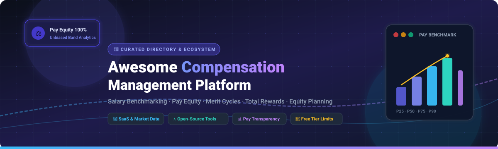

 

# 💎 Awesome Compensation Management Platform

### 🚀 The Definitive Ecosystem of Compensation Software, Salary Benchmarking, Pay Equity & Total Rewards Platforms

**Curated Directory of SaaS Solutions & Open-Source Software for Modern Total Rewards Teams**  
*Covers Salary Benchmarking · Pay Equity Audits · Merit & Bonus Cycles · Equity Management · Global Payroll · Total Compensation Analytics*

**📅 Last updated: August 2026**

---

## 📌 Table of Contents

- [🌟 Overview & SEO Meta Summary](#-overview--seo-meta-summary)
- [🏢 SaaS & Hosted Compensation Platforms (Ranked by Scale / Valuation)](#-saas--hosted-compensation-platforms-ranked-by-scale--valuation)
- [💻 Open-Source GitHub Projects (Ranked by Stars ⭐)](#-open-source-github-projects-ranked-by-stars-)
- [🧩 Key Functional Building Blocks](#-key-functional-building-blocks)
- [📈 Star History](#-star-history)
- [🤝 How to Contribute](#-how-to-contribute)
- [⚖️ Disclaimer & Compliance](#️-disclaimer--compliance)

---

## 🌟 Overview & SEO Meta Summary

Welcome to the **Awesome Compensation Management Platform** repository! This curated knowledge base tracks industry-leading **enterprise SaaS platforms** and **active open-source repositories** designed for modern human resources (HR), people analytics, and Total Rewards leaders.

### 🎯 Primary Capabilities Covered:
- 📊 **Real-time Salary Benchmarking**: Real-time market pricing datasets, salary bands, and percentile distributions (P25, P50, P75, P90).
- ⚖️ **Pay Equity & Compliance**: Automated statistical gap analysis (gender/ethnicity), EU Pay Transparency Directive compliance, and unadjusted/adjusted pay ratio metrics.
- 🎯 **Merit & Incentive Cycles**: Configurable budget allocations, manager review workflows, variable compensation, and performance bonus modeling.
- 📈 **Equity & Total Rewards**: Startup stock option modeling, RSU vesting tracking, total compensation statements, and dilution scenario analysis.

---

## 🏢 SaaS & Hosted Compensation Platforms (Ranked by Scale / Valuation)

The table below lists the premier SaaS compensation platforms sorted in **descending order of organizational size, market valuation, or enterprise annual revenue**.

| Platform | Description | Enterprise Scale / Valuation 🏆 | Starting Tier Pricing 💵 | Free Tier / Free Trial Limits 🎁 |
| :--- | :--- | :--- | :--- | :--- |
| **[Oracle Compensation](https://www.oracle.com/)** | Global enterprise cloud compensation within Oracle HCM Cloud for multi-national workforce budgeting, variable pay, and equity programs. | **~$400B+ Market Cap** (Enterprise Mega-Cap; $53B+ Annual Revenue) | **$28–$38 PEPM** (Per Employee Per Month; typical contract minimums of 1,000 users / ~$33.6k base annual commitment). | **Oracle Cloud 30-day Free Trial**: Includes $300 cloud credits. HCM module evaluation is provided via dedicated enterprise demo sandbox. |
| **[Workday Compensation](https://www.workday.com/)** | Native compensation and total rewards module within the industry-standard Workday HCM suite for budgeting, merit cycles, and pay equity. | **~$70B+ Market Cap** (Enterprise Cloud Leader; $7.3B+ Annual Revenue) | **$34–$42 PEPM** (Per Employee Per Month), bundled into annual enterprise contracts starting at **$100,000+/year**. | **No open free tier / trial**; enterprise evaluation access is provided strictly through guided RFPs and partner solution previews. |
| **[Radford (Aon)](https://radford.aon.com/)** | Gold-standard global compensation benchmarking data and human capital analytics database covering tech, life sciences, and executive pay. | **~$65B+ Market Cap (Aon plc)** (Global Total Rewards & Risk Giant) | Single survey module access starts at **$5,000–$15,000/year** (enterprise multi-survey packages typically $40,000–$80,000+/year). | **No free tier/trial**; operates primarily on a "give-to-get" data participation model with discounted survey pricing for participants. |
| **[PayScale](https://www.payscale.com/)** *(incl. Payfactors & MarketPay)* | Comprehensive market pricing suite, salary structures, real-time datasets, and compensation cycle management software. | **~$1.5B+ Valuation** (Francisco Partners; estimated $150M+ ARR) | Entry-level packages start at **$15,000/year** (average mid-market contracts range from $15,000–$50,000/year). | **Payfactors Free / Salary Checker**: Free forever to price limited basic job benchmarks; enterprise suite available via guided sandbox demo. |
| **[Pave](https://www.pave.com/)** | Modern real-time compensation intelligence platform for real-time market data, salary bands, equity visualizer, and merit cycles. | **$1.6B Valuation** (Unicorn status; backed by Andreessen Horowitz & Index) | Paid tiers (Market Data Pro & Planning Suite) start from **~$15,000/year** (typical contracts $15,000–$40,000/year). | **Market Data Lite** (Free forever): Free for companies up to 200 employees; includes benchmark access across 200+ job families in the US + 1 custom market and automated HRIS/ATS sync. |
| **[beqom](https://www.beqom.com/)** | Enterprise-grade total compensation platform covering merit, performance bonus, long-term incentives (LTI), and sales commissions. | **~$500M+ Valuation** (Sumeru Equity Partners backed; Top Enterprise Tier) | Enterprise annual contracts start at **$50,000–$75,000/year** based on global entity count and module deployment. | **No free tier / trial**; custom proofs of concept and guided product sandbox tours available via enterprise demo. |
| **[Salary.com](https://www.salary.com/)** *(incl. CompAnalyst & CompXL)* | Industry-standard total compensation management suite featuring CompAnalyst for market survey data, job grading, and merit matrices. | **~$350M–$450M Valuation** (Industry Pioneer; 20+ years market presence) | CompAnalyst starting tiers begin at **$8,000–$12,000/year** for small-to-midsize deployments. | **14-day free trial** for CompAnalyst Market Data (access US & Canada pay benchmarks); SHRM members receive 1 free benchmark job report. |
| **[HRSoft](https://www.hrsoft.com/)** | Specialized compensation planning and management platform (Grow, Scale, Elevate packages) for complex multi-matrix enterprise merit cycles. | **~$150M–$200M Valuation** (Private Equity backed; Established Mid-Market/Enterprise) | Entry package ("Grow") starts at **$10,000–$18,000/year** (or ~$3–$5 PEPM depending on volume). | **No open free trial**; 30-day guided evaluation pilot offered upon sales consultation. |
| **[Compa](https://www.compa.com/)** | Real-time offer-acceptance compensation intelligence and AI agent workflows for enterprise talent acquisition and comp teams. | **~$100M–$150M Valuation** (Series A/B venture-backed; fast-growing tech comp specialist) | Market Data Tier starts at **$35,000/year**; enterprise AI Agents tier custom-quoted. | **No free tier**; 30-day pilot evaluations available upon enterprise sales qualification. |
| **[OpenComp](https://www.opencomp.com/)** | End-to-end compensation management software for building salary bands, pay equity compliance, and merit review cycles. | **~$80M–$100M Valuation** (Series A venture-backed; J.P. Morgan, 8VC) | Comp Benchmarking tier starts at **$4,500/year** (Strategy tier at $8,500/year; Comp Cycles at $15,000/year). | **Free forever plan**: Free for startups and small organizations with up to 50 employees (includes basic salary benchmarks); also offers a **14-day full feature free trial**. |
| **[Ravio](https://ravio.com/)** | European-headquartered compensation benchmarking and planning platform with live employer-sourced data and EU pay transparency tools. | **~$40M–$60M Valuation** (Backed by Northzone, Cherry Ventures) | Starts at **£5,000/year** (~$6,500/year) for core benchmarking (~500 employees baseline). | **3 Free Benchmarks**: No permanent free suite; provides access to 3 free job role benchmarks on-demand. Promotional partner access (1-year free benchmarking) available for eligible orgs (25+ employees). |
| **[Figures](https://figures.hr/)** | European compensation management platform emphasizing salary bands, pay equity audits, and salary review planning. | **~$30M–$50M Valuation** (Backed by Point Nine, Bpifrance) | Starts at **€1,700–€3,000/year** (~$1,850–$3,250/year) for baseline benchmarking packages. | **No free tier**; evaluation available via 14-day assisted demo trial upon sales engagement. |
| **[Compport](https://www.compport.com/)** | Global compensation and total rewards software for salary reviews, incentive compensation, and pay equity. | **~$20M–$35M Valuation** (Global mid-market HR tech player) | Starts at **$12,000/year** (or ~$1.50–$3 PEPM depending on organizational scale). | **No self-serve free tier**; offers a 14-day guided proof-of-concept / sandbox trial following a sales demonstration. |

---

## 💻 Open-Source GitHub Projects (Ranked by Stars ⭐)

Open-source compensation engines, internal salary transparency tools, pay equity algorithms, and payroll systems sorted by **GitHub Stargazers (descending)**.

| Project & Repository | GitHub_Stars Badge | Primary Language / Stack | Key Features & Focus |
| :--- | :--- | :--- | :--- |
| **[Akaunting](https://github.com/akaunting/akaunting)** |  | PHP / Laravel / Vue.js | Robust modular open-source accounting & payroll management platform with automated salary calculation, expense tracking, and contractor disbursements. |
| **[Frappe HR / ERPNext](https://github.com/frappe/hrms)** |  | Python / JavaScript | Full-featured open-source HRIS and Payroll engine featuring configurable salary structures, tax rules, attendance integration, merit incentives, and employee lifecycle management. |
| **[Horilla HR](https://github.com/horilla/horilla-hr)** |  | Python / Django | Modern open-source HR and compensation framework with employee contract management, payroll processing, attendance tracking, and customizable bonus allowance rules. |
| **[Open Salaries](https://github.com/sizovs/open-salaries)** |  | Markdown / Docs | Curated collection of open-salary companies, transparent pay matrices, real-world case studies, and policy frameworks for building unbiassed pay scales. |
| **[CeleryBand](https://github.com/maybeanerd/celeryband)** |  | TypeScript / React / Node | Internal salary transparency platform enabling employees to anonymously input, visualize, and compare salary bands and percentile spreads within an organization. |
| **[Comparator](https://github.com/DevonPeroutky/comparator)** |  | JavaScript / HTML5 | Client-side tech offer evaluator and startup equity calculator modeling option grant dilution, valuation milestones, strike prices, and total rewards scenarios. |
| **[Comp Pulse](https://github.com/jschulman/comp-pulse)** |  | Python / Streamlit | Directional compensation tracker and analytics dashboard scraping public job postings and salary disclosure notices to visualize salary band drift. |

---

## 🧩 Key Functional Building Blocks

When assembling a modern compensation management technology stack:

- 🧱 **Foundational Core HR & Payroll**: Use [Frappe HR](https://github.com/frappe/hrms) or [Akaunting](https://github.com/akaunting/akaunting) for employee records, salary slips, tax withholding, and master pay data.
- 🔍 **Internal Pay Equity & Transparency**: Implement [CeleryBand](https://github.com/maybeanerd/celeryband) or [Open Salaries](https://github.com/sizovs/open-salaries) guidelines to maintain salary transparency and eliminate unadjusted pay gaps.
- 🧮 **Offer Modeling & Total Rewards**: Deploy [Comparator](https://github.com/DevonPeroutky/comparator) for candidate offer breakdowns, equity grant projections, and tax implications.
- 🤖 **Automated Benchmarking & ML Analytics**: Leverage [Comp Pulse](https://github.com/jschulman/comp-pulse) alongside Python/R data pipelines for statistical compa-ratio analysis and market drift forecasting.

---

## 📈 Star History

---

## 🤝 How to Contribute

Contributions to expand this ecosystem are warmly welcomed! 🌟

1. 🍴 **Fork** this repository.
2. 🌿 **Create a Branch**: `git checkout -b feature/add-new-tool`
3. 📝 **Add/Update Entry**: Follow the tabular format with factual descriptions, verified starting prices, transparent free tier limits, or GitHub star counts.
4. 🚀 **Submit PR**: Open a Pull Request with a short summary of the addition.

---

## ⚖️ Disclaimer & Compliance

- 🔒 **Data Privacy**: Compensation data contains highly sensitive Personally Identifiable Information (PII) and pay details subject to GDPR, CCPA, and statutory privacy regulations.
- 📜 **Regulatory Standards**: Self-hosted and proprietary implementations should be regularly audited for compliance with Equal Pay regulations and the EU Pay Transparency Directive.
- 📢 **Independent Curation**: This is a community-maintained list and does not constitute formal financial, legal, or compensation advisory services.

---

**Made with ❤️ for Total Rewards Leaders, People Analytics Engineers, and Compensation Professionals.**  
*Star ⭐ this repository if you find it helpful for your compensation strategy!*

